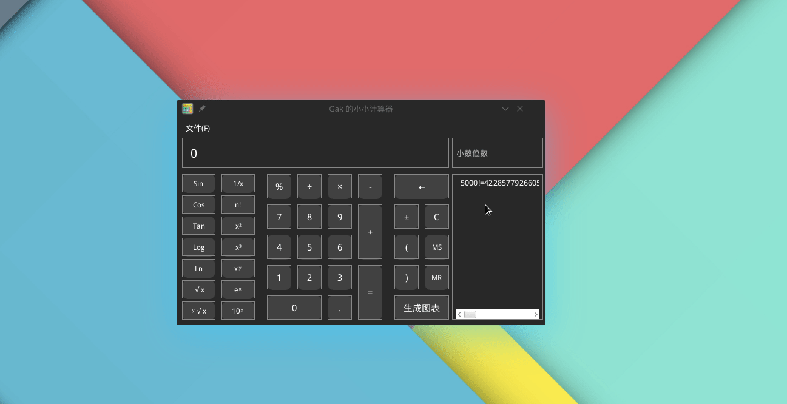

= Gak 的小小计算器

一个比赛的成果，利用 javafx 制作的小小科学计算器，比赛完后又做了些完善。

- 支持四则运算、科学计算
- 支持结果导入导出
- 支持大数运算
- 支持表达式记忆
- 支持图表生成
- 使用多线程，界面和逻辑分离

待优化

1. 前端代码有点紊乱
2. 一些小细节

video::img/计算.mp4[计算过程]

video::img/图表.mp4[图表生成]
